 

<!-- ============ SECTION 1 · IDENTITY CARD (glitch) ============ -->

  

 

## &#9656; About

I'm **Kush**, a fullstack + AI developer studying at the **Institute of Advanced Research (IAR)**. I build products from database to deployment — leaning on **TypeScript/Python** on the backend and **React/Next.js** on the front, with AI features woven in where they actually help the user rather than as a gimmick. Two-time hackathon finalist, currently shipping side projects while open to new work.

 

## &#9656; Tech Stack

<table align="center">
<tr>
<td align="center" valign="top" width="20%">

**Language**
 
 
TypeScript · Python · JavaScript

</td>
<td align="center" valign="top" width="20%">

**Frontend**
 
 
React · Next.js · Tailwind · HTML

</td>
<td align="center" valign="top" width="20%">

**Backend**
 
 
Node.js · Express · FastAPI

</td>
<td align="center" valign="top" width="20%">

**Database**
 
 
Postgres · MongoDB · Supabase

</td>
<td align="center" valign="top" width="20%">

**Infra**
 
 
Docker · Vercel · Render

</td>
</tr>
</table>

 

## &#9656; Projects

<table>
<tr>
<td width="50%" valign="top">

### 💊 KYP Pharma
Pharma-focused product platform, live in production.
 

</td>
<td width="50%" valign="top">

### 🏢 R Square Services
Client services site built end-to-end.
 

</td>
</tr>
<tr>
<td width="50%" valign="top">

### 🎓 Bunk Buddy
Helps students plan (and survive) bunking lectures.
 

</td>
<td width="50%" valign="top">

### 🧠 FlowMind
AI-driven flow / productivity tool.
 

</td>
</tr>
</table>

 

## &#9656; GitHub Stats

### 🐍 Contribution Snake

  

↑ animated contribution snake — generated automatically by the workflow in <code>.github/workflows/snake.yml</code> once Actions runs on this repo (see setup note below).

 
 

## &#9656; Connect

 

 

<b>Setup notes (one-time, read before pushing)</b>

 

This file only turns into your live profile page under a few conditions:

1. **Repo name must be `kush1126`** — a repo exactly matching your username, public, with this `README.md` at its root, is what GitHub renders on your profile page.
2. **Folder structure** — keep `assets/glitch-card.svg` and `assets/profile.jpg` next to each other; the card references the photo with a relative path.
3. **Contribution snake** — the workflow at `.github/workflows/snake.yml` needs Actions enabled on the repo (Settings → Actions → Allow all actions) and "Read and write permissions" for the workflow token (Settings → Actions → Workflow permissions). Run it once manually from the Actions tab (`workflow_dispatch`) — it creates an `output` branch with the animated SVG the README points to.
4. **Stats cards** (`github-readme-stats`, streak stats, top-langs) are hosted by a public third-party service — they can be slow to refresh on first load and occasionally rate-limit; give them a minute or refresh the page.
5. **True 3D isn't possible in a GitHub README** — GitHub strips `<script>` and disallows WebGL/Three.js, so there's no real 3D rendering here. What you're getting instead are the tricks people actually use for "animated 3D-feeling" profiles: SMIL-animated SVGs (the glitch card, the wave banners), layered gradients + shadows for depth, and a GitHub Action that literally animates a snake eating your contribution graph. If you want genuine 3D/WebGL, that would need to live on a personal website instead, linked from here.

