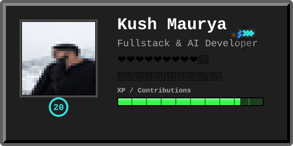
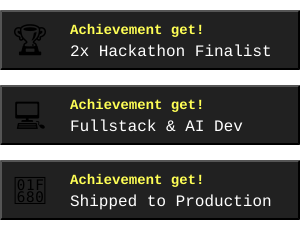
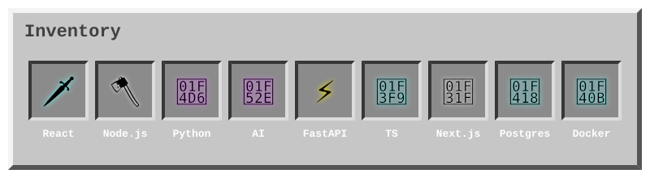
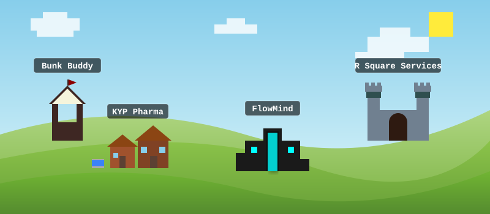

# 🚧 Project Craftfolio

  

 

<table align="center" style="border: none; background: transparent;">
  <tr>
    <td width="60%" align="center" valign="middle" style="border: none;">
      
    </td>
    <td width="40%" align="center" valign="middle" style="border: none;">
      
    </td>
  </tr>
</table>

 

  <i>A Minecraft-inspired interactive GitHub profile experience.</i>

---

  

<<<<<<< HEAD
---

  <h2>🏰 World Map (Projects)</h2>
  
  
   
   
  
  
  
  
  

---

## 📊 Stats & 🐍 Contribution Cave (Coming Soon)
<!-- Milestone 3 will add custom GitHub stats and animated snake cave -->
> *Mining diamonds...*

---

  <h3>🎮 Server Info</h3>
  

    <b>Gamemode:</b> Creative &nbsp;&nbsp;|&nbsp;&nbsp; 
    <b>Difficulty:</b> Hard &nbsp;&nbsp;|&nbsp;&nbsp; 
    <b>Current Biome:</b> Snow Mountains &nbsp;&nbsp;|&nbsp;&nbsp; 
    <b>Seed:</b> <code>11262006</code>
  

=======
 

## ▶ GitHub Stats

 

 

## &#9656; Connect

 

 

<b>Setup notes (one-time, read before pushing)</b>

 

This file only turns into your live profile page under a few conditions:

1. **Repo name must be `kush1126`** — a repo exactly matching your username, public, with this `README.md` at its root, is what GitHub renders on your profile page.
2. **Folder structure** — keep `assets/glitch-card.svg` and `assets/profile.jpg` next to each other; the card references the photo with a relative path.
3. **Contribution snake** — the workflow at `.github/workflows/snake.yml` needs Actions enabled on the repo (Settings → Actions → Allow all actions) and "Read and write permissions" for the workflow token (Settings → Actions → Workflow permissions). Run it once manually from the Actions tab (`workflow_dispatch`) — it creates an `output` branch with the animated SVG the README points to.
4. **Stats cards** (`github-readme-stats`, streak stats, top-langs) are hosted by a public third-party service — they can be slow to refresh on first load and occasionally rate-limit; give them a minute or refresh the page.
5. **True 3D isn't possible in a GitHub README** — GitHub strips `<script>` and disallows WebGL/Three.js, so there's no real 3D rendering here. What you're getting instead are the tricks people actually use for "animated 3D-feeling" profiles: SMIL-animated SVGs (the glitch card, the wave banners), layered gradients + shadows for depth, and a GitHub Action that literally animates a snake eating your contribution graph. If you want genuine 3D/WebGL, that would need to live on a personal website instead, linked from here.

>>>>>>> 2e7fc2ccf37236074536ced8af3ad2d0a001d0ea
